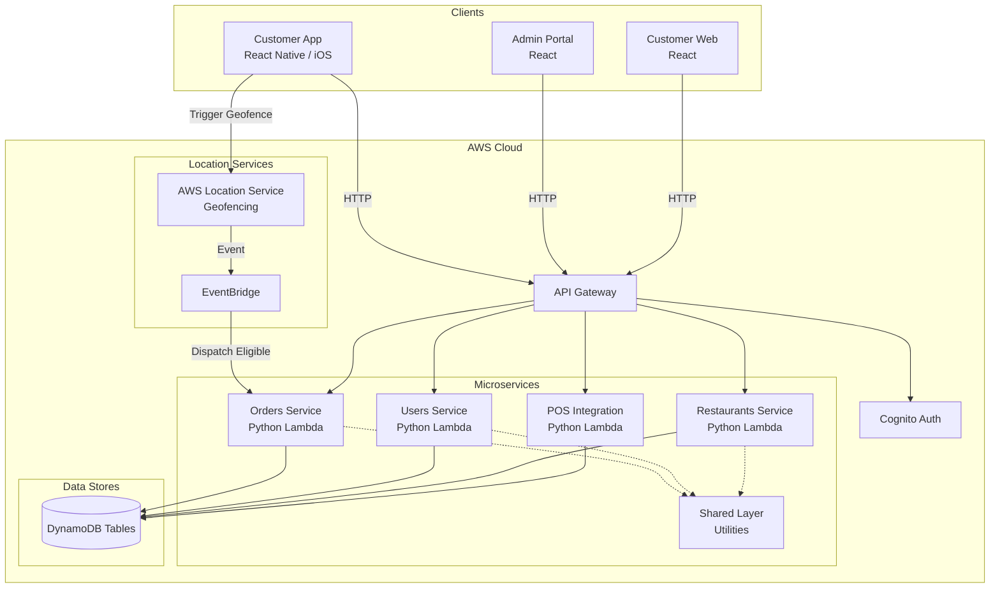

# Arrive Platform

> GPS-Powered Just-in-Time Kitchen Orchestration

**Built with ❤️ via AI pair programming.**

---

## 🧭 Overview

Arrive is a capacity-aware order orchestration platform. It flips the traditional takeout and curbside model on its head by delaying kitchen dispatch until the customer is physically approaching the restaurant, ensuring food is always freshly prepared exactly when they arrive.

### Geofencing & Capacity Logic

1. **Background Geofencing**: The customer's mobile app tracks their location and triggers geofence events as they approach the restaurant's location.
2. **Just-in-Time Dispatch**: When the customer breaches a configurable radius (e.g., `5_MIN_OUT`, `PARKING`, `AT_DOOR`), a dispatch-eligible event is sent to the backend.
3. **Capacity Engine**: The backend evaluates real-time kitchen capacity using highly concurrent, pessimistic locking (via DynamoDB conditional writes).
    - If the kitchen is **at capacity**, the order enters a `WAITING_FOR_CAPACITY` state and continuously retries as slots free up.
    - If a slot is **available**, capacity is reserved, and the order is immediately dispatched to the kitchen (`SENT_TO_DESTINATION`).

---

## 🏗️ Architecture



### Directory Structure

```text
packages/          → Frontend Apps
  customer-web/    → React customer ordering
  admin-portal/    → Admin portal for managing operations
  mobile-ios/      → React Native iOS app

services/          → Backend Microservices
  orders/          → Order lifecycle management
  users/           → User profile management
  restaurants/     → Restaurant data management
  pos-integration/ → Point of Sale integration
  shared/          → Shared Lambda Layer (CORS, auth, serialization, logger)

infrastructure/    → SAM templates, scripts, and AWS infrastructure
```

---

## 🛠️ Tech Stack

- **Frontend:** React, React Native, TypeScript
- **Backend:** Python 3.11, AWS Lambda, DynamoDB
- **Infrastructure:** AWS SAM, API Gateway, Cognito, S3, CloudFront, CloudWatch
- **Shared Layer:** Cross-cutting utilities deployed as a Lambda Layer (CORS, auth, serialization, structured logger)
- **Observability:** CloudWatch metric filters, alarms, and dashboard for order lifecycle and capacity monitoring

---

## 🚀 Quick Start

```bash
# Install dependencies
npm install

# Start customer web
npm run dev:customer

# Start admin portal
npm run dev:admin

# Start iOS app
npm run dev:ios
```

### Services

| Service | Port | Purpose |
|---------|------|---------|
| Customer Web | 5173 | Customer ordering |
| Admin Portal | 5174 | Admin operations |
| iOS (Expo) | 8081 | Mobile app |

---

## 🧪 Testing

```bash
# Run all backend suites in isolation (recommended)
python3 -m pytest tests/test_python_suites.py -q

# Run individual service
python3 -m pytest services/orders/tests/ -q
python3 -m pytest services/restaurants/tests/ -q
python3 -m pytest services/users/tests/ -q
python3 -m pytest services/pos-integration/tests/ -q
python3 -m pytest infrastructure/tests/ -q
```