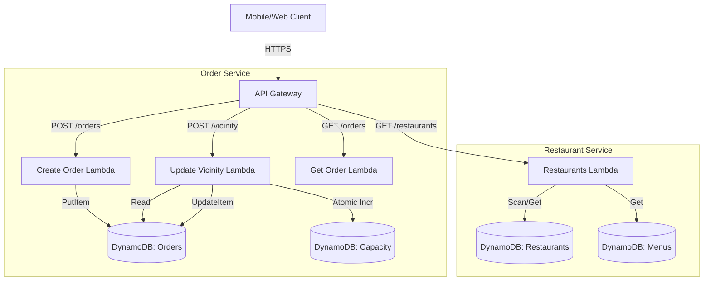
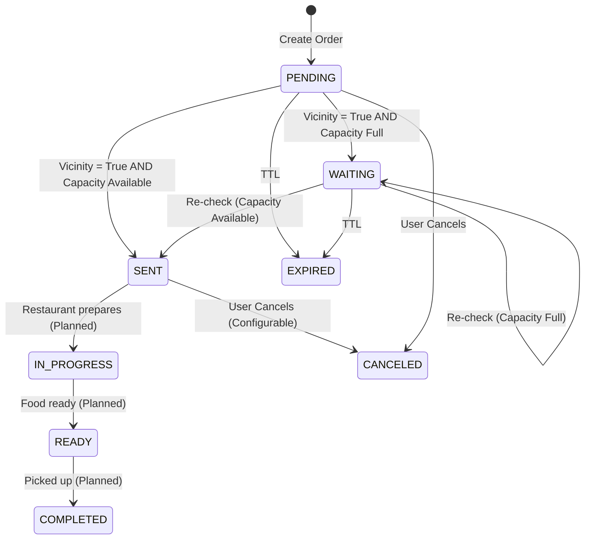

```markdown
# System Design: Arrive API

## 1. Overview
**Arrive** is a capacity-gated dispatch system designed to safely transition customer intent (orders) into provider work (fulfillment) based on real-time eligibility signals (e.g., location/vicinity) and capacity constraints.

The core value proposition is **atomic capacity reservation**: dispatching work only when the provider has the capacity to handle it, preventing overbooking and ensuring a smooth flow of orders.

## 2. Architecture
The system is built on a **Serverless Architecture** using AWS primitives.

### High-Level Architecture


### Components
- **API Gateway**: Entry point for all client requests.
- **OrdersFunction**: Monolithic Lambda handling multiple routes via a unified router (`services/orders/src/app.py`).
  - Handles `POST /orders`, `POST /vicinity`, `GET /orders`, etc.
  - Enforces the capacity-gated dispatch logic.
- **RestaurantsFunction**: Manages restaurant profiles and menus.
- **DynamoDB Tables**:
  - `OrdersTable`: Stores order state and lifecycle.
  - `CapacityTable`: Stores time-windowed capacity counters (e.g., "50 units available between 12:00-12:10").
  - `RestaurantsTable`: Restaurant metadata.
  - `RestaurantConfigTable`: Configuration for capacity limits.
  - `MenusTable`: Versioned menus.

### API Surface Summary
> **Note**: See [`docs/04-api-reference.md`](docs/04-api-reference.md) for full request/response definitions.

**Health**
- `GET /v1/health`

**Restaurants**
- `GET /v1/restaurants`
- `GET /v1/restaurants/{restaurant_id}/menu`
- `GET /v1/restaurants/{restaurant_id}/orders?status=...`

**Orders**
- `POST /v1/orders`
- `GET /v1/orders/{order_id}`
- `POST /v1/orders/{order_id}/vicinity`
- `POST /v1/restaurants/{restaurant_id}/orders/{order_id}/ack`

## 3. Data Model

### Order Entity (`OrdersTable`)
| Field | Type | Description |
|---|---|---|
| `order_id` | String (PK) | Unique identifier (e.g., `ord_...`) |
| `restaurant_id` | String | ID of the target restaurant |
| `status` | String | Current state (PENDING, SENT, WAITING, etc.) |
| `vicinity` | Boolean | Signal if customer is near |
| `prep_units_total` | Number | capacity cost of this order |
| `expires_at` | Number (TTL) | Auto-cleanup timestamp |

### Capacity Window (`CapacityTable`)
| Field | Type | Description |
|---|---|---|
| `restaurant_id` | String (PK) | Target restaurant |
| `window_start` | Number (SK) | Unix timestamp of window start |
| `used_units` | Number | Total units currently reserved. Invariant: `0 <= used_units <= max_units` |
| `ttl` | Number | Expiry for the window data (auto-cleanup) |

## 4. End-to-End Workflows

### 4.1. Order Creation (Intent)
The customer places an order. It is stored but **not yet dispatched**.
1.  **Client** sends `POST /v1/orders`.
2.  **System** validates items and calculates `prep_units_total`.
3.  **System** saves Order with status `PENDING`.
4.  **System** returns `order_id`.

### 4.2. Dispatch via Vicinity (The "Dispatch Logic")
When the customer enters the geofence (vicinity), the system attempts to dispatch.
1.  **Client** polls `POST /v1/orders/{id}/vicinity` with `vicinity: true` (Idempotent).
    - Recommended `retry_after`: 30-60s if status remains WAITING.
    - **Stateless Server**: The server is stateless beyond DynamoDB; the order state in `OrdersTable` determines the response.
2.  **System** (`decide_vicinity_update`):
    - Checks if order is `PENDING` or `WAITING`.
    - **Capacity Check**:
        - Calculates current time window (e.g., 10-minute buckets).
        - Reads `RestaurantConfig` for limits.
        - Attempts **Atomic Increment** of `used_units` on `CapacityTable`.
    - **If Capacity Available**:
        - Update Order -> `STATUS_SENT` (Dispatched).
        - Set `sent_at`, `capacity_window_start`.
    - **If Capacity Full**:
        - Update Order -> `STATUS_WAITING`.
        - Calculate `suggested_start_at` (start of next window).
        - Return wait guidance to client.

### 4.3. Restaurant Acknowledgment (Receipt Modes)
The system supports two tiers of receipt reliability.

**A. Soft Receipt (Default)**
- **Behavior**: When an order transitions to `SENT`, we assume it is "likely received".
- **Mechanism**: No explicit action required from the restaurant.
- **Use Case**: Default operation, similar to standard aggregator apps (UberEats/DoorDash).

**B. Hard Receipt (Escalation)**
- **Behavior**: Restaurant tablet explicitly confirms receipt.
- **Mechanism**: Tablet sends `POST .../ack`. System upgrades `receipt_mode` to `HARD`.
- **Use Case**: High-assurance environments, SLA guarantees, or recovering from outages.
- **Invariant**: `receipt_mode` can only transition `SOFT` -> `HARD`. Downgrades are never allowed.
- **Note**: Hard receipt is **optional**. We do *not* block the customer workflow on this acknowledgment.

## 5. State Machine
The order lifecycle is deterministic and enforced by the engine.



## 6. Key Invariants
1.  **Safety Over Throughput**: Never dispatch if capacity reservation fails.
2.  **No Implicit Dispatch**: Orders stay `PENDING` until explicit vicinity signal.
3.  **Atomic Reservations**: DynamoDB atomic counters ensure we never exceed strict capacity limits, even under high concurrency.

## 6. Critical Analysis & Trade-offs (Senior SDE Review)

### 6.1. Dual-Write Consistency Challenge
**Observation**: The system updates `CapacityTable` (increment used_units) and `OrdersTable` (status change) in separate operations.
-   **Risk**: If `CapacityTable` is updated but `OrdersTable` update fails (e.g., network timeout), we have a "Capacity Leak" (capacity is consumed but order is not sent).
-   **Safety Invariant**: We never mark an order `SENT` unless the capacity reservation succeeded.
-   **Mitigation (Current)**: The system favors safety. A leak is better than an overbook (safety > liveness).
-   **Leak Repair**: Leaks are self-healing.
    -   **Short Windows**: Windows are 10 minutes. A leak only affects the current window.
    -   **TTL**: Data automatically expires.
-   **Future Improvement**: Use `TransactWriteItems` to update both tables in a single ACID transaction.

### 6.2. Scalability: Hot Partitions
**Observation**: The `CapacityTable` key is `restaurant_id`.
-   **Risk**: A mega-chain restaurant with 10k orders/min could throttle the partition.
-   **Analysis**:
    -   **Typical Load**: SMB restaurants peak at <100 orders/hour. A single DynamoDB partition (~1000 WCU) easily handles this.
    -   **Mega-Scale**: For global chains, we would shard the `restaurant_id` (e.g., `restaurant_id#shard_N`) and use conditional increments.

### 6.3. Client Polling vs. Push updates
**Observation**: Restaurants poll for orders.
-   **Risk**: Latency and wasted compute on empty polls.
-   **Future Improvement**: Implement WebSockets (API Gateway) or IoT Core for real-time order push to restaurant tablets.

## 7. Reliability & Semantics

### 7.1. Idempotency
-   **`POST /vicinity`**: Fully idempotent. Safe to retry on loop.
-   **`POST /ack`**: Idempotent. Repeated calls return success with current state.
-   **`POST /orders`**: Currently **not** idempotent (creates new UUID). Future: Add `Idempotency-Key` header support.

### 7.2. Observability
Key signals for operational health:
-   **Dashboards**:
    -   Dispatch Success Rate (Sent vs. Attempts)
    -   Capacity Blocked Rate (Waiting vs. Attempts)
    -   Time spent in `WAITING` state
    -   Capacity Utilization (Used Units / Max Units per window)
    -   Receipt Mode Split (% Hard vs % Soft) - tracks restaurant tablet adoption.
-   **Alarms**:
    -   High `5xx` rate on core routes.
    -   DynamoDB Throttles (Read/Write).
    -   Conditional Check Failed spikes (indicates high contention or bugs).

### 7.3. Security (Current Status)
-   **Current**: Prototype mode (Open API).
-   **Future**:
    -   **Client**: JWT Authorizer via Cognito.
    -   **Restaurant**: API Keys or Mutual TLS for tablets.
```