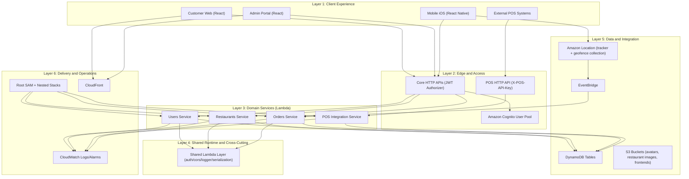

# 12 - Layered Architecture, Access Model, and Endpoint Inventory

Version: 1.0  
Last updated: 2026-03-02

## 1. Purpose and Scope

This document describes the current production-oriented architecture of the Arrive platform by:

1. Breaking the system into layers and components.
2. Explaining how access control works across user-facing and machine-facing APIs.
3. Enumerating service endpoints and who can call them.
4. Listing the important application-logic files and what each file is responsible for.

This document is implementation-derived from the current codebase under:
- `infrastructure/`
- `services/*/`
- `packages/*/`

Important:
- This document is intentionally code-first and does not depend on older architecture markdown files.
- Endpoint, access, and component statements are derived from current handlers, routers, and SAM templates.

## 2. Architecture Layers

## 2.1 Layered View

## 2.2 Layer Responsibilities

| Layer | Responsibility |
|---|---|
| Client Experience | User interaction, token acquisition, API calls, polling/tracking UX |
| Edge and Access | Request ingress, JWT authorization for core APIs, API-key auth for POS |
| Domain Services | Business logic for users, restaurants/menu/config/favorites, orders/lifecycle/capacity, POS adapters |
| Shared Runtime | Common auth claim parsing, CORS, response serialization, structured logging |
| Data and Integration | Durable state (DynamoDB), media storage (S3), geolocation events (Amazon Location + EventBridge) |
| Delivery and Operations | IaC deployment, static hosting, observability and alarms |

## 3. Component Breakdown

## 3.1 Client Components

| Component | Primary Responsibilities | Upstream Access |
|---|---|---|
| Customer Web (`packages/customer-web`) | Browse restaurants/menu, place/cancel orders, view statuses, manage profile/favorites | Core JWT APIs (`restaurants`, `orders`, `users`) |
| Admin Portal (`packages/admin-portal`) | Restaurant onboarding/management, menu/config changes, order ops board, global zone admin | Core JWT APIs (`restaurants`, `orders`) |
| Mobile iOS (`packages/mobile-ios`) | Customer order flow, continuous location processing, arrival signal dispatch, profile/favorites | Core JWT APIs + mobile location subsystem |
| External POS | POS-originated order/menu/status/webhook integration | POS API-key surface (`pos-integration`) |

## 3.2 Edge and Identity Components

| Component | Responsibility | Notes |
|---|---|---|
| Core HTTP API (SAM `HttpApi` per service) | Exposes users/restaurants/orders routes with default Cognito JWT authorizer | Route authorization defaults to JWT unless explicitly disabled |
| Cognito User Pool + App Client | End-user identity and JWT issuance | `custom:role` and `custom:restaurant_id` claims drive RBAC |
| POS HTTP API (`PosIntegrationApi`) | Exposes machine-to-machine POS routes | Uses `X-POS-API-Key`; no Cognito dependency |

## 3.3 Domain Service Components

### Users Service

- Stores and updates user profile records.
- Generates avatar upload URLs for S3.
- Health route for service checks.
- Works with post-confirmation flow for profile bootstrap.

### Restaurants Service

- Restaurant CRUD with role-aware field and ownership checks.
- Menu read/write.
- Restaurant config management (capacity, dispatch trigger, POS settings).
- Global config management (zone distances/labels).
- Favorites management (customer scope only).
- Restaurant image upload URL generation.
- Geofence upsert/delete to Amazon Location collection.

### Orders Service

- Customer order create/read/list/cancel.
- Arrival and location ingestion.
- Capacity gating and reservation windows.
- Restaurant order listing and progression operations.
- Geofence EventBridge consumer with shadow/cutover behavior.
- Scheduled order expiry worker.

### POS Integration Service (Optional Deployment)

- Authenticates API keys and checks permissions.
- Maps provider payloads to internal order/menu model.
- Creates/updates/lists orders and menu sync endpoints.
- Generic webhook ingestion with idempotency dedupe.

## 3.4 Data and Integration Components

| Component | Owner | Purpose |
|---|---|---|
| `OrdersTable` | Orders service | Order/session state, lifecycle timestamps, status, arrival metadata |
| `CapacityTable` | Orders service | Atomic capacity counters per `(restaurant_id, window_start)` |
| `IdempotencyTable` | Orders service | Dedup for order create retries using `Idempotency-Key` |
| `GeofenceEventsTable` | Orders service | Dedup for EventBridge geofence events |
| `UsersTable` | Users service | User profile document |
| `RestaurantsTable` | Restaurants service | Restaurant profile and listing attributes |
| `MenusTable` | Restaurants service | Menu document per restaurant/version |
| `RestaurantConfigTable` | Restaurants service | Capacity/dispatch/POS settings; global config record `__GLOBAL__` |
| `FavoritesTable` | Restaurants service | Customer favorite relations |
| `PosApiKeysTable` | POS service | Hashed API keys + permissions + restaurant binding |
| `PosWebhookLogsTable` | POS service | Idempotent webhook event log with TTL |
| `UserAvatarsBucket` | Users service | Avatar upload and public read path |
| `RestaurantImagesBucket` | Restaurants service | Restaurant image uploads |
| Amazon Location tracker | Root infra + orders | Device position ingestion |
| Amazon Location geofence collection | Root infra + restaurants/orders | Restaurant geofence geometry + ENTER events |

## 3.5 Event-Driven Components

| Event Source | Consumer | Behavior |
|---|---|---|
| `Location Geofence Event` (EventBridge) | `orders/src/geofence_events.py` | Deduplicates event, resolves candidate order, records shadow metadata, optionally applies dispatch transition if cutover is enabled |
| Scheduled `rate(5 minutes)` | `orders/src/expire_orders.py` | Expires stale `PENDING_NOT_SENT` and `WAITING_FOR_CAPACITY` orders |
| Cognito PostConfirmation trigger | `infrastructure/src/post_confirmation.py` | Sets default role if absent and inserts user profile |

## 4. Access Control Model

## 4.1 Authentication Modes

| Mode | Used By | Token/Header |
|---|---|---|
| Cognito JWT | Users, Restaurants, Orders services | `Authorization: Bearer <id_token>` |
| API Key | POS integration service | `X-POS-API-Key: <raw_key>` |

## 4.2 Role Model (JWT Surfaces)

| Role/Identity | Intended Persona | Authorization Behavior |
|---|---|---|
| `admin` | Platform super-admin | Broad access to admin routes and all restaurants |
| `restaurant_admin` | Single restaurant operator | Restricted to assigned `restaurant_id` for owner routes |
| `customer` | Customer app/web user | Customer routes only |
| Roleless authenticated user (no restaurant binding) | Legacy/federated customer fallback | Treated as `customer` by shared auth logic |

## 4.3 POS Permission Model

| Permission | Needed For |
|---|---|
| `orders:write` | create order, update status, force fire, webhook ingestion |
| `orders:read` | list POS-facing orders |
| `menu:read` | retrieve menu |
| `menu:write` | sync menu |
| `*` | full wildcard |

## 4.4 Principal Access Summary

| Principal | Allowed API Surfaces |
|---|---|
| Customer (JWT) | Restaurants read (active scope), menu read, favorites, users profile/avatar, customer order routes |
| Restaurant admin (JWT) | Own restaurant manage/update, own menu/config, own restaurant orders operations |
| Platform admin (JWT) | Full restaurants admin + global config + all restaurant order ops |
| POS key (API key) | Only POS routes, scoped by key permissions and bound restaurant |

## 5. Endpoint Inventory and Access Matrix

## 5.1 Orders Service Endpoints

| Method | Path | Auth | Allowed Callers | Handler | Purpose |
|---|---|---|---|---|---|
| POST | `/v1/orders` | JWT | `customer` (or roleless+no restaurant binding) | `handlers/customer.py:create_order` | Create order with idempotency support |
| GET | `/v1/orders/{order_id}` | JWT | Customer owner only | `handlers/customer.py:get_order` | Read one customer order |
| GET | `/v1/orders/{order_id}/advisory` | JWT | Customer owner only | `handlers/customer.py:get_leave_advisory` | Non-reserving leave estimate |
| GET | `/v1/orders` | JWT | Customer scope | `handlers/customer.py:list_customer_orders` | List customer order history |
| POST | `/v1/orders/{order_id}/location` | JWT | Customer owner only | `handlers/customer.py:ingest_location` | Ingest raw location sample and publish device position |
| POST | `/v1/orders/{order_id}/vicinity` | JWT | Customer owner only | `handlers/customer.py:update_vicinity` | Arrival event ingestion and dispatch attempt |
| POST | `/v1/orders/{order_id}/cancel` | JWT | Customer owner only | `handlers/customer.py:cancel_order` | Cancel pending/waiting order |
| GET | `/v1/restaurants/{restaurant_id}/orders` | JWT | `admin` or matching `restaurant_admin` | `handlers/restaurant.py:list_restaurant_orders` | Restaurant queue listing |
| POST | `/v1/restaurants/{restaurant_id}/orders/{order_id}/ack` | JWT | `admin` or matching `restaurant_admin` | `handlers/restaurant.py:ack_order` | Acknowledge incoming order receipt |
| POST | `/v1/restaurants/{restaurant_id}/orders/{order_id}/status` | JWT | `admin` or matching `restaurant_admin` | `handlers/restaurant.py:update_order_status` | Progress order status chain |

Additional non-HTTP order components:
- `orders/src/geofence_events.py` consumes EventBridge geofence ENTER events.
- `orders/src/expire_orders.py` runs scheduled expiration every 5 minutes.

## 5.2 Restaurants Service Endpoints

| Method | Path | Auth | Allowed Callers | Handler | Purpose |
|---|---|---|---|---|---|
| GET | `/v1/restaurants/health` | JWT (service route has no role check) | Any authenticated user | `app.py` | Health response |
| GET | `/v1/restaurants` | JWT | All authenticated users (results filtered by role) | `handlers/restaurants.py:list_restaurants` | List restaurants |
| POST | `/v1/restaurants` | JWT | `admin` only | `handlers/restaurants.py:create_restaurant` | Create restaurant + config + optional Cognito user |
| GET | `/v1/restaurants/{restaurant_id}` | JWT | `admin`, matching `restaurant_admin`, customer (active-only visibility) | `handlers/restaurants.py:get_restaurant` | Get one restaurant |
| PUT | `/v1/restaurants/{restaurant_id}` | JWT | `admin` or matching `restaurant_admin` | `handlers/restaurants.py:update_restaurant` | Update restaurant profile |
| DELETE | `/v1/restaurants/{restaurant_id}` | JWT | `admin` only | `handlers/restaurants.py:delete_restaurant` | Delete restaurant and linked records |
| GET | `/v1/restaurants/{restaurant_id}/menu` | JWT | Any authenticated user | `handlers/menu.py:get_menu` | Read active menu |
| POST | `/v1/restaurants/{restaurant_id}/menu` | JWT | `admin` or matching `restaurant_admin` | `handlers/menu.py:update_menu` | Overwrite active menu |
| GET | `/v1/restaurants/{restaurant_id}/config` | JWT | `admin` or matching `restaurant_admin` | `handlers/config.py:get_config` | Read capacity/dispatch/POS config |
| PUT | `/v1/restaurants/{restaurant_id}/config` | JWT | `admin` or matching `restaurant_admin` | `handlers/config.py:update_config` | Update capacity/dispatch/POS config |
| GET | `/v1/admin/global-config` | JWT | `admin` only | `handlers/config.py:get_global_config` | Read global zone config |
| PUT | `/v1/admin/global-config` | JWT | `admin` only | `handlers/config.py:update_global_config` | Update global zone config and geofence resync |
| GET | `/v1/favorites` | JWT | Customer scope only | `handlers/favorites.py:list_favorites` | List customer favorites |
| PUT | `/v1/favorites/{restaurant_id}` | JWT | Customer scope only | `handlers/favorites.py:add_favorite` | Add favorite |
| DELETE | `/v1/favorites/{restaurant_id}` | JWT | Customer scope only | `handlers/favorites.py:remove_favorite` | Remove favorite |
| POST | `/v1/restaurants/{restaurant_id}/images/upload-url` | JWT | `admin` or matching `restaurant_admin` | `handlers/images.py:create_image_upload_url` | Presigned upload URL for restaurant image |

Important runtime gate:
- If a `restaurant_admin` belongs to an inactive restaurant, app-level gate blocks most mutation routes except selected self-management routes.

## 5.3 Users Service Endpoints

| Method | Path | Auth | Allowed Callers | Handler | Purpose |
|---|---|---|---|---|---|
| GET | `/v1/users/health` | None (`Authorizer: NONE`) | Public/internal checks | `app.py` | Health response |
| GET | `/v1/users/me` | JWT | Authenticated user | `handlers/users.py:get_profile` | Get profile |
| PUT | `/v1/users/me` | JWT | Authenticated user | `handlers/users.py:update_profile` | Update allowed profile fields |
| POST | `/v1/users/me/avatar/upload-url` | JWT | Authenticated user | `handlers/users.py:create_avatar_upload_url` | Presigned avatar upload URL |

## 5.4 POS Integration Endpoints

| Method | Path | Auth | Permission | Handler | Purpose |
|---|---|---|---|---|---|
| POST | `/v1/pos/orders` | API key | `orders:write` | `handlers.py:handle_create_order` | POS creates Arrive order |
| GET | `/v1/pos/orders` | API key | `orders:read` | `handlers.py:handle_list_orders` | POS reads restaurant orders |
| POST | `/v1/pos/orders/{order_id}/status` | API key | `orders:write` | `handlers.py:handle_update_status` | POS updates order state |
| POST | `/v1/pos/orders/{order_id}/fire` | API key | `orders:write` | `handlers.py:handle_force_fire` | Manual dispatch override |
| GET | `/v1/pos/menu` | API key | `menu:read` | `handlers.py:handle_get_menu` | POS reads menu |
| POST | `/v1/pos/menu/sync` | API key | `menu:write` | `handlers.py:handle_sync_menu` | POS pushes menu (feature-flagged) |
| POST | `/v1/pos/webhook` | API key | `orders:write` | `handlers.py:handle_webhook` | Generic webhook ingress with idempotency |

POS deployment note:
- Root infrastructure deploys POS stack only when `DeployPosIntegration=true`.

## 6. Core Runtime Flows

## 6.1 Customer Order Creation and Dispatch Readiness

1. Customer app calls `POST /v1/orders`.
2. Orders service validates payload and idempotency key.
3. Order is persisted as `PENDING_NOT_SENT`.
4. Customer sends arrival event (`/vicinity`) or location sample (`/location`).
5. On dispatch-eligible event meeting trigger threshold:
   - Orders service checks capacity in current window.
   - If reserved: transition to `SENT_TO_DESTINATION`.
   - If full: transition to `WAITING_FOR_CAPACITY` with suggestion metadata.

## 6.2 Restaurant Operations Progression

1. Admin/restaurant admin polls `GET /v1/restaurants/{restaurant_id}/orders`.
2. Optional ack via `/ack` to set receipt mode.
3. Status progression via `/status` enforces state machine:
   - `SENT_TO_DESTINATION -> IN_PROGRESS -> READY -> FULFILLING -> COMPLETED`.
4. On completion/cancel, capacity slot is released if reserved.

## 6.3 Mobile Geolocation and EventBridge Geofence Path

1. Mobile tracking module computes arrival events and posts to `/vicinity`.
2. Mobile location samples post to `/location`; orders service forwards positions to Location tracker.
3. Location ENTER events are emitted to EventBridge.
4. `geofence_events.py` deduplicates and records shadow trail.
5. If cutover flag is enabled and shadow is not forced, geofence event applies real state transitions.

## 6.4 User Profile Bootstrap and Avatar Flow

1. Cognito PostConfirmation trigger invokes `post_confirmation.py`.
2. Trigger sets default `custom:role=customer` if missing and creates profile row.
3. Clients call users endpoints for profile get/update.
4. Avatar upload is two-step:
   - Request presigned URL from users service.
   - Upload directly to S3.

## 6.5 POS Inbound Flow

1. POS calls `/v1/pos/*` with `X-POS-API-Key`.
2. POS service hashes key and validates table record/TTL.
3. Permission check per route.
4. Payload mapping (`pos_mapper.py`) converts provider schema to internal model.
5. Service reads/writes shared orders/menu tables scoped to key's `restaurant_id`.

## 7. Important Application Logic Files and Responsibilities

This section lists primary implementation files where core logic resides.

## 7.1 Infrastructure and Deployment Wiring

| File | Responsibility |
|---|---|
| `infrastructure/template.yaml` | Root stack: Cognito, Location resources, shared layer, nested services, frontend hosting, cross-service wiring |
| `infrastructure/src/post_confirmation.py` | Cognito post-confirmation trigger: default role assignment and `UsersTable` profile bootstrap |
| `infrastructure/src/app.py` | Minimal infrastructure health lambda |

## 7.2 Shared Runtime (Cross-Service)

| File | Responsibility |
|---|---|
| `services/shared/python/shared/auth.py` | Normalizes JWT claims into role/restaurant/customer identity model |
| `services/shared/python/shared/cors.py` | Dynamic CORS origin matching and common CORS header generation |
| `services/shared/python/shared/serialization.py` | Decimal-safe JSON serialization and standard response builder |
| `services/shared/python/shared/logger.py` | Structured JSON logger, correlation id extraction, timing helper |

## 7.3 Orders Domain

| File | Responsibility |
|---|---|
| `services/orders/template.yaml` | Orders stack resources, HTTP routes, geofence consumer, scheduled expiry |
| `services/orders/src/app.py` | HTTP route router and role/ownership gate for customer vs restaurant routes |
| `services/orders/src/handlers/customer.py` | Customer order flows: create/get/list/advisory/location/vicinity/cancel |
| `services/orders/src/handlers/restaurant.py` | Restaurant order flows: list/ack/status progression |
| `services/orders/src/engine.py` | Pure decision/state-machine logic for transitions and validations |
| `services/orders/src/capacity.py` | Capacity window reservation/release and advisory estimation logic |
| `services/orders/src/dynamo_apply.py` | Safe builder that converts update plans to DynamoDB update expressions |
| `services/orders/src/db.py` | Shared table clients and auth helper extraction inside orders service |
| `services/orders/src/location_bridge.py` | Amazon Location tracker publish bridge for raw device positions |
| `services/orders/src/geofence_events.py` | EventBridge geofence ENTER consumer with dedupe + shadow/cutover behavior |
| `services/orders/src/expire_orders.py` | Scheduled expiration worker with query-first and scan fallback strategy |
| `services/orders/src/models.py` | Status/arrival/payment enums and canonical order/session model aliases |

## 7.4 Restaurants Domain

| File | Responsibility |
|---|---|
| `services/restaurants/template.yaml` | Restaurants stack resources (tables/bucket/routes) and IAM policies |
| `services/restaurants/src/app.py` | Route dispatcher and global inactive-restaurant gate |
| `services/restaurants/src/utils.py` | Shared clients/utilities: claim checks, geocoding helpers, geofence sync, image URL helpers |
| `services/restaurants/src/handlers/restaurants.py` | Restaurant CRUD, role-filtered reads, Cognito user linkage, geofence synchronization |
| `services/restaurants/src/handlers/menu.py` | Menu retrieval and overwrite with normalization/validation |
| `services/restaurants/src/handlers/config.py` | Capacity/dispatch/POS config management and global zone config updates |
| `services/restaurants/src/handlers/favorites.py` | Customer favorites list/add/remove |
| `services/restaurants/src/handlers/images.py` | Presigned restaurant image upload URL generation and limits |

## 7.5 Users Domain

| File | Responsibility |
|---|---|
| `services/users/template.yaml` | Users stack resources (table/avatar bucket/routes) and auth override for health |
| `services/users/src/app.py` | Route dispatcher and top-level error handling |
| `services/users/src/handlers/users.py` | Profile read/update and avatar upload URL issuance with key validation |
| `services/users/src/utils.py` | Users table/client setup and shared response helper wiring |

## 7.6 POS Integration Domain

| File | Responsibility |
|---|---|
| `services/pos-integration/template.yaml` | POS stack resources, dedicated API, API key table, webhook dedupe table, route wiring |
| `services/pos-integration/src/app.py` | POS route dispatcher, API key authentication, permission checks |
| `services/pos-integration/src/auth.py` | API key hashing/lookup/TTL validation and permission helper |
| `services/pos-integration/src/handlers.py` | POS business handlers for order/menu/webhook operations |
| `services/pos-integration/src/pos_mapper.py` | Provider-specific payload mapping between POS schemas and internal schemas |

## 7.7 Client-Side Orchestration Files

| File | Responsibility |
|---|---|
| `packages/customer-web/src/App.jsx` | Customer web app shell and user-order/restaurant/menu flow orchestration |
| `packages/customer-web/src/hooks/useAuth.jsx` | Customer role guard and token retrieval logic |
| `packages/customer-web/src/services/api.js` | Customer web API client for users/favorites and S3 avatar upload |
| `packages/customer-web/src/config.js` | Service base URL configuration |
| `packages/admin-portal/src/components/Dashboard.tsx` | Restaurant operator dashboard, order polling, status operations, auto-promotion flow |
| `packages/admin-portal/src/components/AdminDashboard.tsx` | Super-admin control panel for restaurant and global config administration |
| `packages/admin-portal/src/aws-exports.js` | Admin app auth config and API base URLs |
| `packages/mobile-ios/App.tsx` | Mobile app navigation shell and screen composition |
| `packages/mobile-ios/src/config.ts` | Mobile environment-driven API base URLs |
| `packages/mobile-ios/src/services/api.ts` | Mobile API client for restaurants/orders/users endpoints |
| `packages/mobile-ios/src/services/location/index.ts` | Hybrid tracking orchestration (foreground/task modes, permission handling, event queue) |
| `packages/mobile-ios/src/services/location/processor.ts` | Core hybrid geofence algorithm (zones, TTA, reporting/debounce) |
| `packages/mobile-ios/src/services/location/config.ts` | Location thresholds/radii/debounce constants |
| `packages/mobile-ios/src/screens/OrderScreen.tsx` | Real-time order tracking UI, polling, location lifecycle integration |

## 8. Deployment and Runtime Toggles

| Toggle | Location | Effect |
|---|---|---|
| `DeployPosIntegration` | `infrastructure/template.yaml` parameter | Enables/disables nested POS integration deployment |
| `LocationGeofenceCutoverEnabled` | Root + orders env | When true, geofence EventBridge events can transition order state |
| `LocationGeofenceForceShadow` | Root + orders env | Forces geofence consumer to shadow mode even if cutover is enabled |
| `POS_MENU_SYNC_ENABLED` | POS service env | Enables/disables menu sync endpoint behavior |

## 9. Architectural Boundaries

| Boundary | Current Decision |
|---|---|
| Payments | Not handled by platform; pay-at-restaurant mode only |
| Push status transport | Polling-based status updates in current clients |
| POS rollout | Optional stack deployment behind root parameter |
| Geofence cutover | Controlled by runtime flags with explicit shadow mode support |

---

If this document is updated, also update related architecture docs in this folder so version narratives stay consistent.
