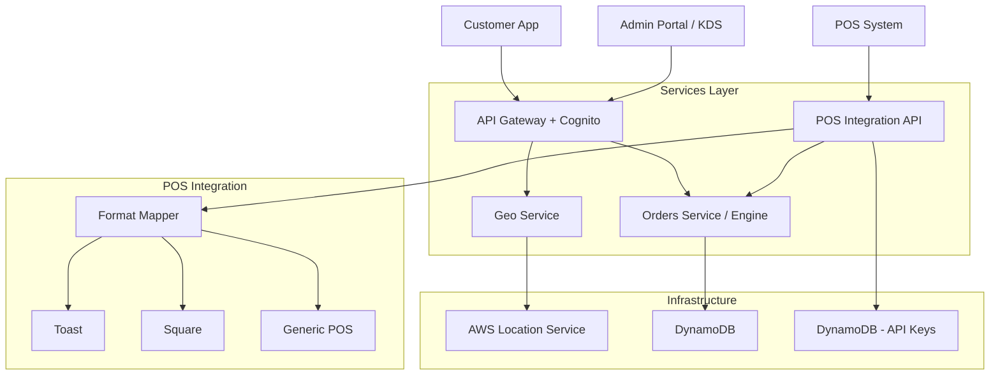

```markdown
# Arrive Platform: System Design Document

**Version:** 2.1  
**Date:** 2026-02-10  
**Status:** Production Ready

---

## 1. Executive Summary

Arrive is a **Just-in-Time Orchestration Platform** that eliminates ordering pipeline wait times by synchronizing physical service fulfillment with user proximity. The platform acts as an **orchestration layer** — not a payment processor — reducing compliance burden while maximizing restaurant throughput.

While initially configured for **Dine-In** (fire the kitchen ticket when the customer is 14 minutes out), the core engine is **domain-neutral** and supports any use case where a resource needs to be prepared exactly when a user arrives (e.g., curbside pickup, medical appointments, logistics).

## 2. High-Level Architecture

The system follows an **Event-Driven Microservices** architecture, organized into a Monorepo.



## 3. Core Concepts (Domain Neutral)

The system is built on four neutral pillars:

| Concept | Description | Dining Alias |
|---------|-------------|--------------|
| **Session** | An active engagement or transaction lifecycle | `Order` |
| **Destination** | The physical location/host of the service | `Restaurant` |
| **Resource** | The item or service being prepared | `Menu Item` |
| **Fulfillment** | The process of preparing the resource | `Kitchen` |

### States & Stages
- **Session Status:** `PENDING_NOT_SENT` → `WAITING_FOR_CAPACITY` → `SENT_TO_DESTINATION` → `IN_PROGRESS` → `READY` → `FULFILLING` → `COMPLETED`
- **Arrival Events:** `5_MIN_OUT` → `PARKING` → `AT_DOOR` → `EXIT_VICINITY`

### Payment Modes
- **`PAY_AT_RESTAURANT`** — Customer pays at the table. Arrive handles timing orchestration only.

## 4. Microservices Breakdown

### A. Orders Service (`services/orders`)
**Role:** The Brain. Manages the lifecycle of a Session.
- **Responsibilities:** Session CRUD, state machine transitions, auto-firing based on proximity events, capacity management.
- **Tech:** Python, DynamoDB (OrdersTable + CapacityTable + IdempotencyTable).
- **Key Tables:**
  - `OrdersTable` — Sessions with GSI on `restaurant_id+status` and `customer_id+created_at`.
  - `CapacityTable` — Windowed capacity tracking per restaurant.

### B. POS Integration Service (`services/pos-integration`)
**Role:** The Bridge. Translates between POS systems and Arrive's domain format.
- **Responsibilities:** Format mapping (Toast, Square, generic), menu sync, order push to POS, webhook processing.
- **Auth:** Custom API key authentication (X-POS-API-Key header), not Cognito JWT.
- **Tech:** Python, DynamoDB (PosApiKeysTable + PosWebhookLogsTable).

### C. Restaurants Service (`services/restaurants`)
**Role:** The Catalog. Serves restaurant and menu data from DynamoDB.
- **Responsibilities:** List active restaurants, serve menus by version.
- **Tech:** Python, DynamoDB (RestaurantsTable + MenusTable + RestaurantConfigTable).

> **Note:** Arrive does **not** include a Payments Service. Payment is handled either by the POS system or a third-party processor. Arrive orchestrates timing, not money.

## 5. Key Workflows

### The "Eliminated Wait Time" Flow
1. **Order Placed:** Customer creates a Session via the app. Status: `PENDING_NOT_SENT`.
2. **Monitoring:** Geo Service monitors customer location via background GPS.
3. **Proximity Trigger:** When `ETA ≤ Prep Time`, the engine transitions to `SENT_TO_DESTINATION` — POS receives the ticket.
4. **Progressive Arrival:** `5_MIN_OUT` → `PARKING` → `AT_DOOR` events update the KDS in real-time.
5. **Fulfillment:** Kitchen prepares the order, advancing through `IN_PROGRESS` → `READY`.
6. **Handoff:** Customer arrives. Food is plated. Session → `COMPLETED`.

### Arrive Fee Model
- A small per-order fee (`$0.29 base + 1.5% of order`) is split between restaurant and customer.
- Calculated at session creation via `calculate_arrive_fee()`.
- The fee is **recorded** on the Session but **not processed** by Arrive — billing is handled externally.

## 6. Frontend Applications

| App | Package | Tech | Purpose |
|-----|---------|------|---------|
| **Customer Web** | `packages/customer-web` | React + Vite | Web-based ordering with real-time order history |
| **Admin Portal** | `packages/admin-portal` | React + Vite | KDS, dashboards, restaurant management |
| **Mobile App** | `packages/mobile-ios` | React Native | Native experience with background GPS arrival tracking |

## 7. Configuration & Extensibility

- **Domain Config:** The "Dining" domain is configured via `shared/types` aliases.
- **New Industries:** To add "Medical Appointments", create a new frontend package and map `Session` → `Appointment`, `Destination` → `Clinic`, `Resource` → `Doctor`.
- **New POS Systems:** Extend `services/pos-integration/src/pos_mapper.py` with a new format translator.

## 8. Development

- **Monorepo:** Managed via Turborepo.
- **Mock Server:** `tools/mock-server` provides full offline testing with POS routes.
- **Seed Scripts:** `infrastructure/scripts/seed/menu_item.json` populates restaurants and menus.
- **Tests:** Unit tests for engine logic and POS mapper are located in the respective `tests` directories.

---
**Prepared by:** Agent Tau  
**Updated by:** Antigravity Agent (v2.1 — POS Orchestration Pivot)
```
